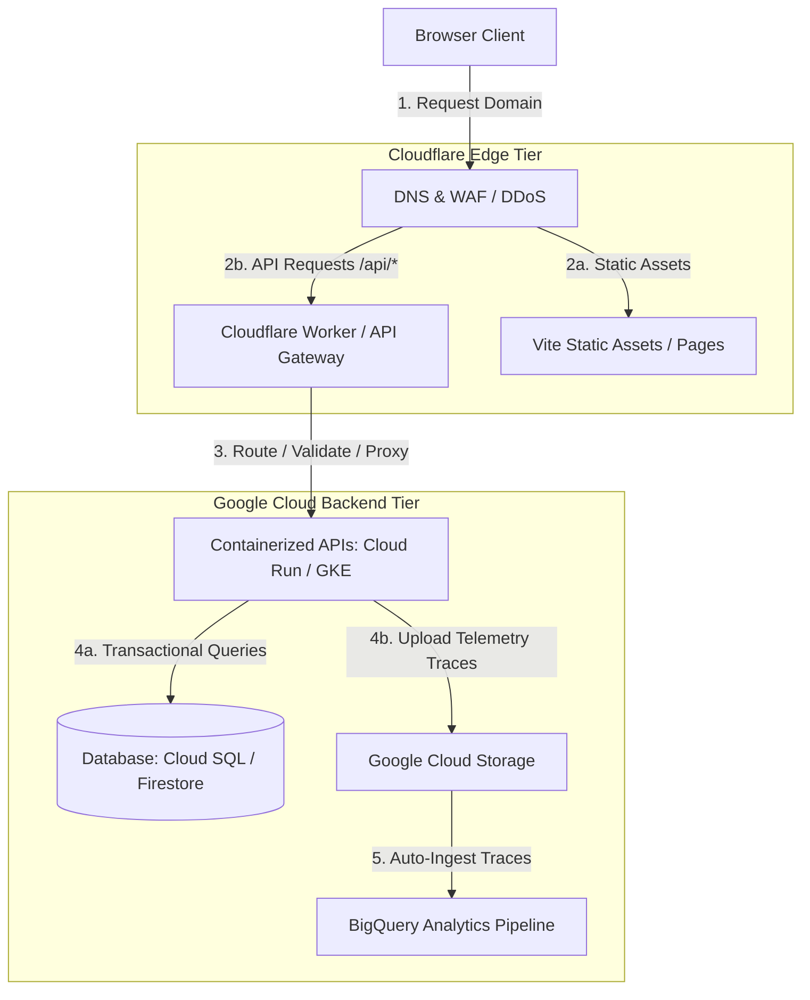

# Multi-Cloud Backend Integration: Cloudflare & Google Cloud

This guide outlines a step-by-step workflow to configure and transition the Lavender production repository to a dual-backend architecture. In this design:
- **Cloudflare** acts as the Edge Tier (handling DNS, CDN, DDoS protection, WAF, and API Gateway Routing via Workers).
- **Google Cloud Platform (GCP)** acts as the Application & Data Tier (hosting containerized API services, heavy database storage, and analytics pipelines).

---

## 1. Architectural Design

The system divides responsibilities to maximize the performance of both platforms:



### Allocation of Services

| Category | Service Provider | Responsibility |
| :--- | :--- | :--- |
| **DNS & CDN** | Cloudflare | Static asset caching, DDoS protection, and WAF rules. |
| **API Gateway** | Cloudflare Workers | Fast request validation, route handling, pre-flight CORS headers, and forwarding requests to GCP. |
| **Containerized APIs** | GCP Cloud Run / GKE | Running backend services (OpenAI/Gemini proxy APIs, trace processors, and business logic) inside Docker containers. |
| **Database Storage** | GCP (Cloud SQL / Firestore / Spanner) | Managing heavy transactional data and session states securely. |
| **Analytics Pipelines**| GCP (GCS + BigQuery) | Storing and streaming response telemetry for LLM analysis, token counting, and usage reporting. |

---

## 2. Step-by-Step Transition Workflow

---

### Phase 1: Establish the GCP Backend Environment
Set up the core resources on Google Cloud to receive traffic from Cloudflare.

1. **Initialize the GCP Project & APIs**:
   - Create a Google Cloud project (e.g., `lavender-production`).
   - Enable services for serverless containers, storage, and databases:
     ```bash
     CLOUDSDK_METRICS_ENVIRONMENT="gcs-skills gcs-skills/1.0 (skill:google-cloud-storage-basics)" \
     gcloud services enable run.googleapis.com storage.googleapis.com secretmanager.googleapis.com bigquery.googleapis.com --project=lavender-production
     ```

2. **Database & Storage Provisioning**:
   - Provision a database instance (e.g., **Cloud SQL** for SQL or **Firestore** for NoSQL documents) depending on data modeling needs.
   - Create a Google Cloud Storage (GCS) bucket (e.g., `gs://lavender-telemetry-prod`) to store log traces.

3. **Enable Analytics Ingestion**:
   - Create a BigQuery dataset `lavender_analytics`.
   - Setup a Cloud Storage transfer job or a Pub/Sub trigger to automatically ingest incoming GCS traces into BigQuery tables for analysis.

---

### Phase 2: Containerize and Deploy APIs to GCP
Package the API backend logic currently in the repository into a containerized application.

1. **Dockerize the Application**:
   - Create a standard Node.js Express server inside a new `/backend` folder.
   - Set up the server to handle the model requests (`/api/model-a`, `/api/model-b`) and trace retrieval endpoints.
   - Configure a database connection pool to communicate with Cloud SQL/Firestore.

2. **Deploy to Cloud Run (or GKE)**:
   - Deploy to **Cloud Run** for lightweight auto-scaling (scaling down to zero instances when idle to save costs):
     ```bash
     gcloud run deploy lavender-backend-api \
       --source ./backend \
       --region us-central1 \
       --allow-unauthenticated \
       --project=lavender-production
     ```
   - Store all API keys (OpenAI, Gemini) and database credentials inside **GCP Secret Manager** and reference them in the container runtime environment.

---

### Phase 3: Configure Cloudflare Worker as API Gateway
Update the existing Cloudflare Worker ([`src/worker.js`](file:///home/john/Downloads/project/artbakerchat.github.io/src/worker.js)) to act as an edge router.

1. **Routing and Gateway Proxying**:
   - The edge worker intercepts requests to `/api/*`.
   - Before forwarding to GCP, the worker can validate rate limits or client access controls.
   - Use the `fetch()` API within the worker to proxy requests to the Cloud Run or GKE endpoint:
     ```javascript
     async function handleApiRequest(request, env) {
       const backendUrl = new URL(request.url);
       backendUrl.host = env.GCP_BACKEND_HOST; // Your Cloud Run/GKE Host name
       
       // Clone request with the new destination host
       const proxyRequest = new Request(backendUrl, request);
       
       // Add security headers indicating the request came from Cloudflare
       proxyRequest.headers.set('X-Forwarded-For-Worker', 'true');
       proxyRequest.headers.set('Authorization', `Bearer ${env.BACKEND_API_SECRET}`);
       
       return await fetch(proxyRequest);
     }
     ```

2. **Edge Asset Serving**:
   - Ensure the static pages (e.g. `index.html`, `events.html`) continue to be served directly from Cloudflare assets at the edge for low latency.

---

### Phase 4: Secure the Connection Between Cloudflare and GCP
Protect the GCP backend from unauthorized direct access.

1. **Restrict Traffic to Cloudflare IPs**:
   - Set up WAF rules or ingress settings on GCP Cloud Run / GKE to only allow requests originating from Cloudflare's public IP ranges.
2. **Implement Gateway Authentication Tokens**:
   - Configure a shared secret key (passed via `BACKEND_API_SECRET` in wrangler secrets and GCP environment settings). The backend container rejects any requests that do not present this token in the header.

---

### Phase 5: CI/CD Pipeline Integration
Ensure consistent deployments to both providers upon pushing code.

1. **GitHub Actions Workflow**:
   - Create a unified pipeline in `.github/workflows/deploy.yml`:
     - **Static Build**: Builds the Vite application and deploys it to Cloudflare Pages/Workers.
     - **Container Build & Deploy**: Builds the Docker image, uploads it to Artifact Registry, and deploys the new revision to Cloud Run or GKE on Google Cloud.