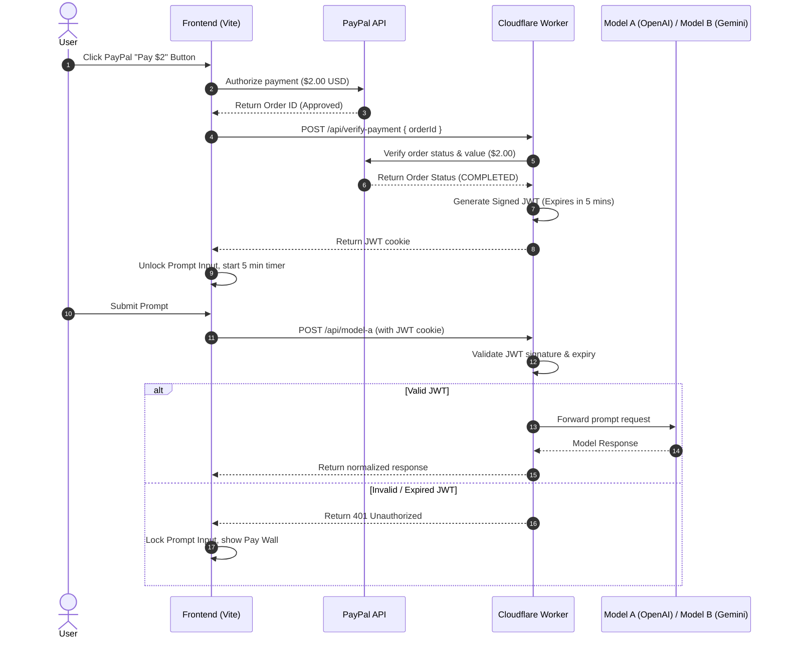

# Step-by-Step Guide: Pay-Per-Access (PayPal) for OpenAI and Gemini Comparison

This guide outlines how to configure OpenAI (Model A) and Google Gemini (Model B) APIs, and restrict access using a PayPal payment button that charges **$2.00 for 5 minutes of access**. It includes both a straightforward client-side implementation and a secure production-ready backend validation architecture.

---

## Architecture Diagram


---

## Step 1: Obtain API Keys

### 1. Model A: OpenAI API Key
1. Visit the [OpenAI Developer Platform](https://platform.openai.com/).
2. Create an account or sign in.
3. Navigate to **API Keys** in the sidebar.
4. Click **Create new secret key**, name it (e.g., `lavender-key`), and copy it.

### 2. Model B: Google Gemini API Key
1. Visit [Google AI Studio](https://aistudio.google.com/).
2. Sign in with your Google Account.
3. Click **Get API key** in the top left.
4. Click **Create API key** and choose a project to associate it with. Copy the generated key.

---

## Step 2: PayPal Developer Setup
To create the payment button, you need a Client ID from PayPal.

1. Go to the [PayPal Developer Portal](https://developer.paypal.com/) and sign in.
2. Under **Apps & Credentials**, toggle to **Sandbox** (for testing) or **Live** (for production).
3. Click **Create App**, name it (e.g., `Lavender Chat`), and click **Create**.
4. Copy the **Client ID** and **Secret**.

---

## Step 3: Frontend Implementation (HTML & CSS)

### 1. Load the PayPal SDK
Add the PayPal SDK script tag to the `<head>` of your [index.html](file:///home/john/Downloads/project/artbakerchat.github.io/index.html). Replace `YOUR_PAYPAL_CLIENT_ID` with the ID copied from Step 2:

```html
<!-- Load PayPal JS SDK -->
<script src="https://www.paypal.com/sdk/js?client-id=YOUR_PAYPAL_CLIENT_ID&currency=USD"></script>
```

### 2. Add Paywall Overlay & Timer Elements
Add the paywall overlay markup and the countdown status in [index.html](file:///home/john/Downloads/project/artbakerchat.github.io/index.html) immediately wrapping the input form:

```html
<!-- Access Countdown and Payment status -->
<div id="payment-status-bar" class="payment-status-bar" style="display: none;">
  <span id="timer-display">Access Active: 05:00 remaining</span>
</div>

<!-- Paywall Overlay -->
<div id="paywall-overlay" class="paywall-overlay">
  <div class="paywall-card">
    <h3>Access Comparison Workspace</h3>
    <p>Get 5 minutes of side-by-side access to Model A and Model B for just $2.00 USD.</p>
    <div id="paypal-button-container"></div>
  </div>
</div>
```

### 3. Add Paywall CSS Styles
Add these rules to your stylesheet (e.g., [style.css](file:///home/john/Downloads/project/artbakerchat.github.io/style.css)) to display a locked overlay:

```css
.paywall-overlay {
  position: fixed;
  top: 0;
  left: 0;
  width: 100vw;
  height: 100vh;
  background: rgba(15, 23, 42, 0.9); /* Dark backdrop */
  display: flex;
  justify-content: center;
  align-items: center;
  z-index: 10000;
  backdrop-filter: blur(8px);
}

.paywall-card {
  background: #1e293b;
  border: 1px solid #334155;
  border-radius: 12px;
  padding: 2rem;
  max-width: 400px;
  text-align: center;
  color: #f8fafc;
  box-shadow: 0 10px 25px -5px rgba(0, 0, 0, 0.3);
}

.paywall-card h3 {
  margin-top: 0;
  font-size: 1.5rem;
}

.payment-status-bar {
  background: #1e293b;
  border: 1px solid #10b981;
  color: #10b981;
  padding: 0.5rem 1rem;
  border-radius: 6px;
  text-align: center;
  margin-bottom: 1rem;
  font-weight: bold;
}
```

---

## Step 4: Frontend Payment Integration (JavaScript)

Modify [app.js](file:///home/john/Downloads/project/artbakerchat.github.io/scripts/app.js) to manage the countdown timer and render the PayPal Smart Button.

```javascript
// Add inside app.js:
(function initPaywall() {
  const paywall = document.querySelector('#paywall-overlay');
  const statusBar = document.querySelector('#payment-status-bar');
  const timerDisplay = document.querySelector('#timer-display');
  const sendBtn = document.querySelector('#sendBtn');
  const promptInput = document.querySelector('#promptInput');

  let countdownInterval;

  function updateUIState(hasAccess) {
    if (hasAccess) {
      paywall.style.display = 'none';
      statusBar.style.display = 'block';
      if (promptInput) promptInput.disabled = false;
      if (sendBtn) sendBtn.disabled = false;
    } else {
      paywall.style.display = 'flex';
      statusBar.style.display = 'none';
      if (promptInput) promptInput.disabled = true;
      if (sendBtn) sendBtn.disabled = true;
    }
  }

  function startCountdown(expiryTime) {
    clearInterval(countdownInterval);
    updateUIState(true);

    countdownInterval = setInterval(() => {
      const remaining = expiryTime - Date.now();
      if (remaining <= 0) {
        clearInterval(countdownInterval);
        localStorage.removeItem('lavender_expiry');
        updateUIState(false);
        alert('Your 5-minute access session has expired.');
      } else {
        const minutes = Math.floor(remaining / 60000);
        const seconds = Math.floor((remaining % 60000) / 1000);
        timerDisplay.textContent = `Access Active: ${minutes.toString().padStart(2, '0')}:${seconds.toString().padStart(2, '0')} remaining`;
      }
    }, 1000);
  }

  // Check storage on page load
  const savedExpiry = localStorage.getItem('lavender_expiry');
  if (savedExpiry && parseInt(savedExpiry, 10) > Date.now()) {
    startCountdown(parseInt(savedExpiry, 10));
  } else {
    updateUIState(false);
  }

  // Render PayPal button
  if (typeof paypal !== 'undefined') {
    paypal.Buttons({
      createOrder: function(data, actions) {
        return actions.order.create({
          purchase_units: [{
            amount: {
              value: '2.00',
              currency_code: 'USD'
            },
            description: '5 Minutes Lavender LLM Workspace Access'
          }]
        });
      },
      onApprove: function(data, actions) {
        return actions.order.capture().then(async function(details) {
          // Send order to backend Cloudflare worker for verification
          const response = await fetch('/api/verify-payment', {
            method: 'POST',
            headers: { 'Content-Type': 'application/json' },
            body: JSON.stringify({ orderId: details.id })
          });

          if (response.ok) {
            const expiry = Date.now() + 5 * 60 * 1000;
            localStorage.setItem('lavender_expiry', expiry.toString());
            startCountdown(expiry);
          } else {
            alert('Payment validation failed. Please contact support.');
          }
        });
      },
      onError: function(err) {
        console.error('PayPal Error:', err);
      }
    }).render('#paypal-button-container');
  }
})();
```

---

## Step 5: Secure Server-Side Verification (Cloudflare Worker)

To prevent users from simply modifying their browser's local storage, implement verification in the backend [src/worker.js](file:///home/john/Downloads/project/artbakerchat.github.io/src/worker.js).

### 1. PayPal API Client Helper
To authorize against PayPal's server, request an access token using your client credentials:

```javascript
async function getPayPalAccessToken(env) {
  const isSandbox = env.PAYPAL_ENVIRONMENT === 'sandbox';
  const apiBase = isSandbox 
    ? 'https://api-m.sandbox.paypal.com' 
    : 'https://api-m.paypal.com';

  const basicAuth = btoa(`${env.PAYPAL_CLIENT_ID}:${env.PAYPAL_CLIENT_SECRET}`);
  const response = await fetch(`${apiBase}/v1/oauth2/token`, {
    method: 'POST',
    headers: {
      'Authorization': `Basic ${basicAuth}`,
      'Content-Type': 'application/x-www-form-urlencoded'
    },
    body: 'grant_type=client_credentials'
  });

  const data = await response.json();
  return { token: data.access_token, apiBase };
}
```

### 2. Verify Order Endpoint
Validate that the order ID is valid, belongs to your merchant credentials, was fully captured, and represents a transaction value of exactly **2.00 USD**:

```javascript
async function verifyPayPalOrder(orderId, env) {
  const { token, apiBase } = await getPayPalAccessToken(env);
  const response = await fetch(`${apiBase}/v2/checkout/orders/${orderId}`, {
    headers: { 'Authorization': `Bearer ${token}` }
  });

  if (!response.ok) return false;
  const order = await response.json();

  // Validate status, currency, and value
  const purchaseUnit = order.purchase_units?.[0];
  const amount = purchaseUnit?.amount?.value;
  const currency = purchaseUnit?.amount?.currency_code;
  
  const isCompleted = order.status === 'COMPLETED' || order.status === 'APPROVED';
  const isCorrectAmount = parseFloat(amount) === 2.00 && currency === 'USD';

  return isCompleted && isCorrectAmount;
}
```

### 3. JWT Signing & Cookie Setting
Once validated, sign a temporary JWT containing the expiration timestamp (5 minutes from now) and return it in a secure HTTP-only cookie.

Add a simple HS256 JWT helper:
```javascript
async function generateSessionCookie(env) {
  const expiry = Math.floor((Date.now() + 5 * 60 * 1000) / 1000);
  const header = { alg: 'HS256', typ: 'JWT' };
  const payload = { exp: expiry };

  const encoder = new TextEncoder();
  const encodedHeader = btoa(JSON.stringify(header));
  const encodedPayload = btoa(JSON.stringify(payload));
  const unsignedToken = `${encodedHeader}.${encodedPayload}`;

  const key = await crypto.subtle.importKey(
    'raw', 
    encoder.encode(env.JWT_SECRET), 
    { name: 'HMAC', hash: 'SHA-256' }, 
    false, 
    ['sign']
  );
  
  const signature = await crypto.subtle.sign('HMAC', key, encoder.encode(unsignedToken));
  const signatureBase64 = btoa(String.fromCharCode(...new Uint8Array(signature)))
    .replace(/\+/g, '-').replace(/\//g, '_').replace(/=/g, '');

  const jwt = `${unsignedToken}.${signatureBase64}`;
  
  return `session_token=${jwt}; Path=/; HttpOnly; Secure; SameSite=Strict; Max-Age=300`;
}
```

### 4. JWT Authorization Verification
Intercept model calls to `/api/model-a` and `/api/model-b` to verify the JWT signature and expiration:

```javascript
async function verifySessionToken(request, env) {
  const cookieHeader = request.headers.get('Cookie') || '';
  const match = cookieHeader.match(/session_token=([^;]+)/);
  if (!match) return false;

  const jwt = match[1];
  const parts = jwt.split('.');
  if (parts.length !== 3) return false;

  const [headerB64, payloadB64, signatureB64] = parts;
  const unsignedToken = `${headerB64}.${payloadB64}`;

  try {
    const encoder = new TextEncoder();
    const key = await crypto.subtle.importKey(
      'raw', 
      encoder.encode(env.JWT_SECRET), 
      { name: 'HMAC', hash: 'SHA-256' }, 
      false, 
      ['verify']
    );

    const binarySignature = new Uint8Array(
      atob(signatureB64.replace(/-/g, '+').replace(/_/g, '/'))
        .split('')
        .map(char => char.charCodeAt(0))
    );

    const isValid = await crypto.subtle.verify('HMAC', key, binarySignature, encoder.encode(unsignedToken));
    if (!isValid) return false;

    const payload = JSON.parse(atob(payloadB64));
    if (Date.now() / 1000 > payload.exp) return false; // Expired

    return true;
  } catch {
    return false;
  }
}
```

### 5. Routing Configuration in `src/worker.js`
In the worker's `fetch()` handler:
1. Handle `/api/verify-payment`:
   ```javascript
   if (pathname === '/api/verify-payment' && request.method === 'POST') {
     const { orderId } = await request.json();
     const isValid = await verifyPayPalOrder(orderId, env);
     if (isValid) {
       const cookie = await generateSessionCookie(env);
       return new Response(JSON.stringify({ success: true }), {
         status: 200,
         headers: {
           'content-type': 'application/json',
           'Set-Cookie': cookie
         }
       });
     }
     return json({ error: 'Invalid transaction' }, 400);
   }
   ```
2. Intercept `/api/model-a` and `/api/model-b`:
   ```javascript
   if (pathname === '/api/model-a' || pathname === '/api/model-b') {
     const hasAccess = await verifySessionToken(request, env);
     if (!hasAccess) {
       return json({ error: 'Access Expired or Unpaid. Please pay $2.00 to restore access.' }, 401);
     }
     // Proceed to model requests...
   }
   ```

---

## Step 6: Deploying Secrets and Running

### 1. Set Local Environment Variables
Create or append secrets in your local `.dev.vars` file (not committed to git):
```ini
# Provider API keys
OPENAI_API_KEY=your_openai_api_key
GEMINI_API_KEY=your_gemini_api_key

# PayPal Configuration
PAYPAL_ENVIRONMENT=sandbox
PAYPAL_CLIENT_ID=your_paypal_sandbox_client_id
PAYPAL_CLIENT_SECRET=your_paypal_sandbox_client_secret

# JWT configuration
JWT_SECRET=super_secret_local_random_key_phrase
```

### 2. Deploy Worker with Secrets
Run these commands to add production secrets directly to your Cloudflare Worker:
```bash
npx wrangler secret put OPENAI_API_KEY
npx wrangler secret put GEMINI_API_KEY
npx wrangler secret put PAYPAL_CLIENT_ID
npx wrangler secret put PAYPAL_CLIENT_SECRET
npx wrangler secret put JWT_SECRET
```

Build and deploy:
```bash
npm run deploy
```